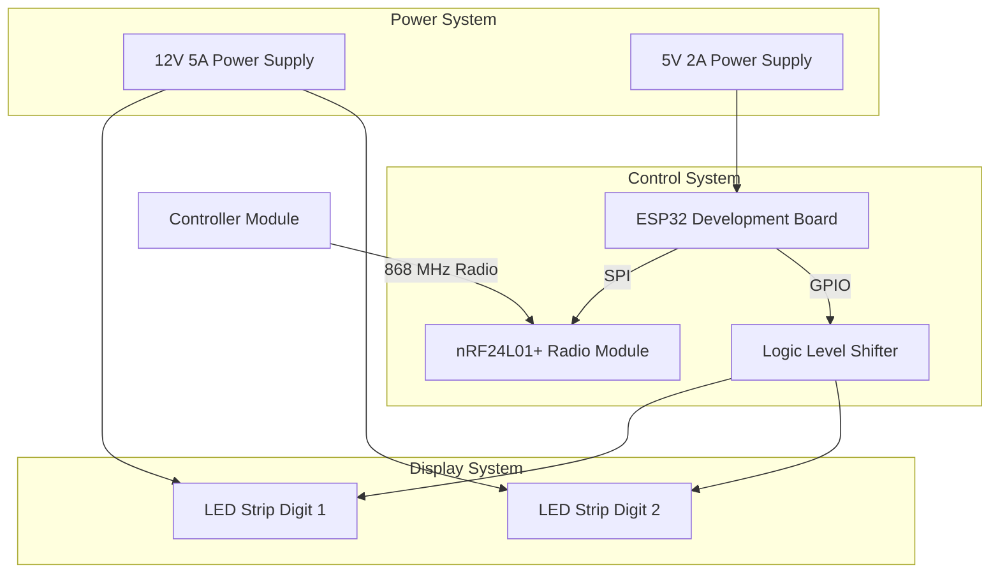
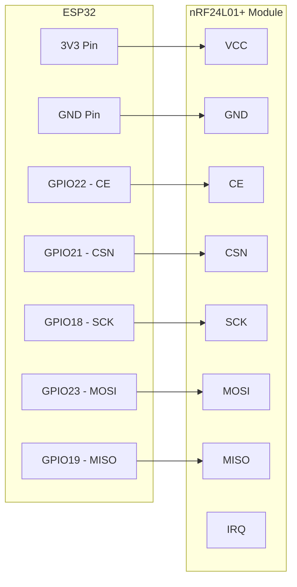
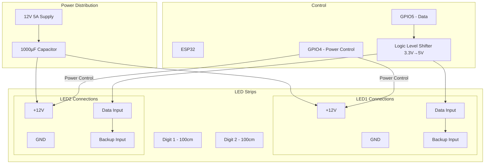
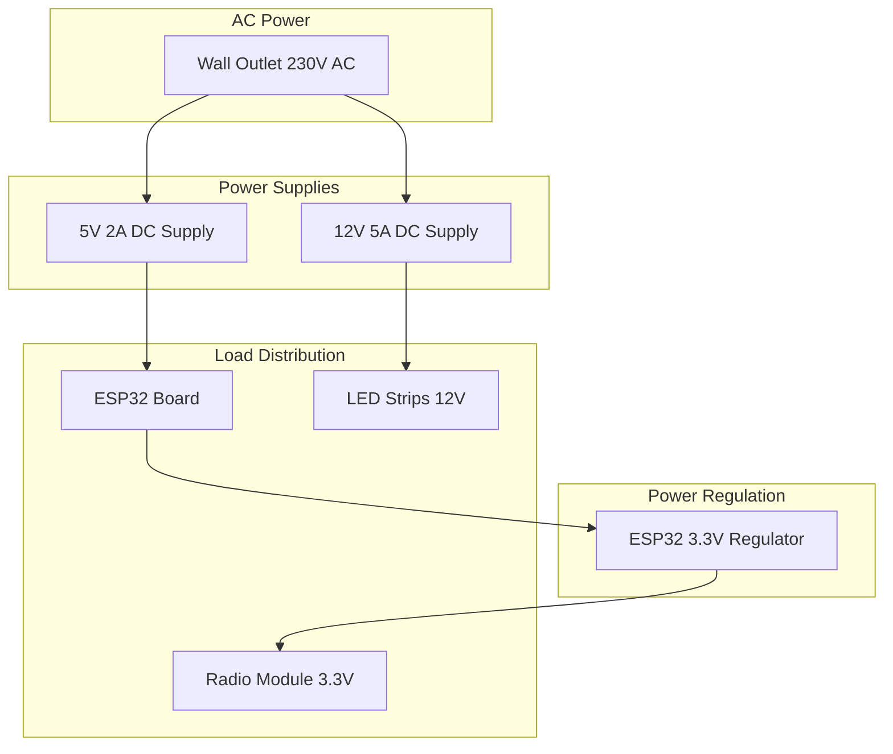
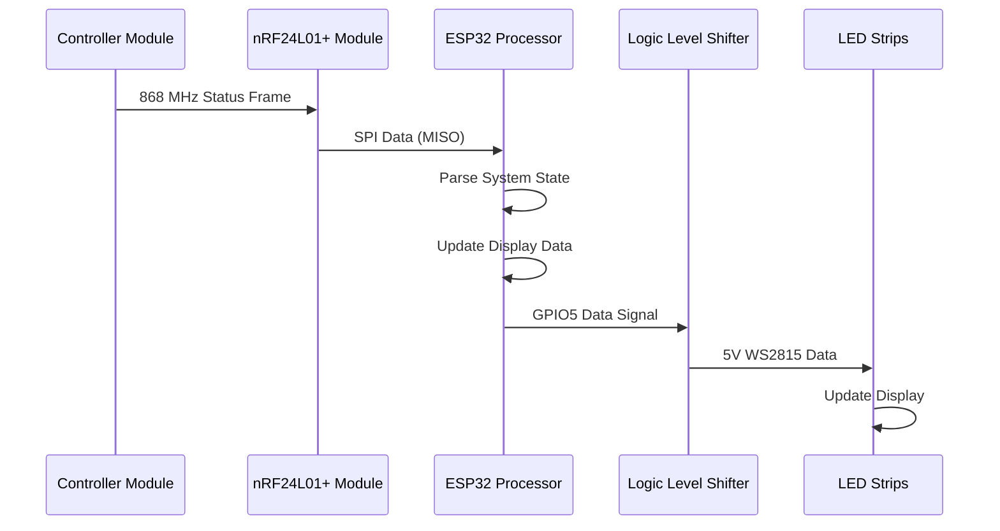
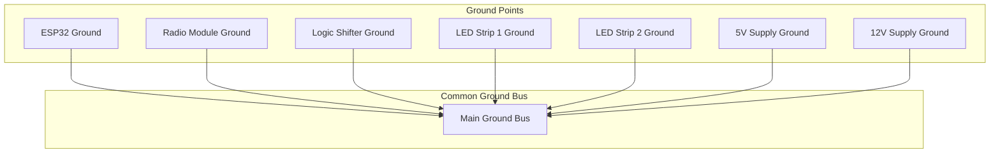
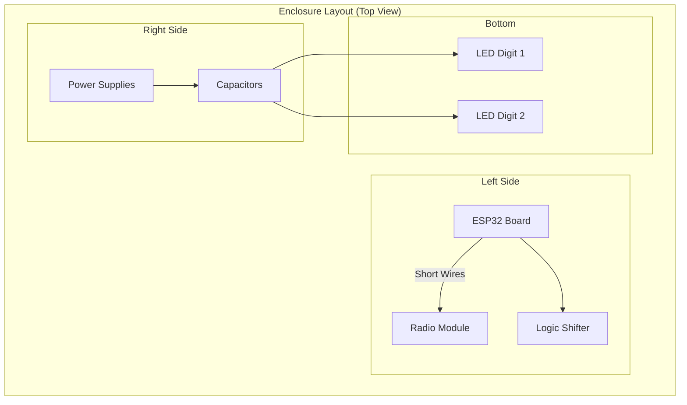

# Connection Flow Diagrams

## System Architecture Overview

## Detailed Pin Connections

### Radio Module Connections

### LED Display Connections

## Power Flow Diagram

## Signal Flow for Data Reception

## Ground System Diagram

## LED Strip Segment Layout

```mermaid
graph TB
    subgraph "7-Segment Display Layout"
        subgraph "Digit 1 (Tens)"
            A_TOP[Segment A - Top]
            B_TOP[Segment B - Top Right]
            C_TOP[Segment C - Bottom Right]
            D_TOP[Segment D - Bottom]
            E_TOP[Segment E - Bottom Left]
            F_TOP[Segment F - Top Left]
            G_TOP[Segment G - Middle]
            DP_TOP[Decimal Point]
        end

        subgraph "Digit 2 (Units)"
            A_BOTTOM[Segment A - Top]
            B_BOTTOM[Segment B - Top Right]
            C_BOTTOM[Segment C - Bottom Right]
            D_BOTTOM[Segment D - Bottom]
            E_BOTTOM[Segment E - Bottom Left]
            F_BOTTOM[Segment F - Top Left]
            G_BOTTOM[Segment G - Middle]
            DP_BOTTOM[Decimal Point]
        end
    end

    subgraph "LED Strip Layout"
        STRIP1[LED Strip 1 - 100cm]
        STRIP2[LED Strip 2 - 100cm]
    end

    STRIP1 --> A_TOP
    STRIP1 --> B_TOP
    STRIP1 --> C_TOP
    STRIP1 --> D_TOP
    STRIP1 --> E_TOP
    STRIP1 --> F_TOP
    STRIP1 --> G_TOP
    STRIP1 --> DP_TOP

    STRIP2 --> A_BOTTOM
    STRIP2 --> B_BOTTOM
    STRIP2 --> C_BOTTOM
    STRIP2 --> D_BOTTOM
    STRIP2 --> E_BOTTOM
    STRIP2 --> F_BOTTOM
    STRIP2 --> G_BOTTOM
    STRIP2 --> DP_BOTTOM
```

## Physical Layout建议

